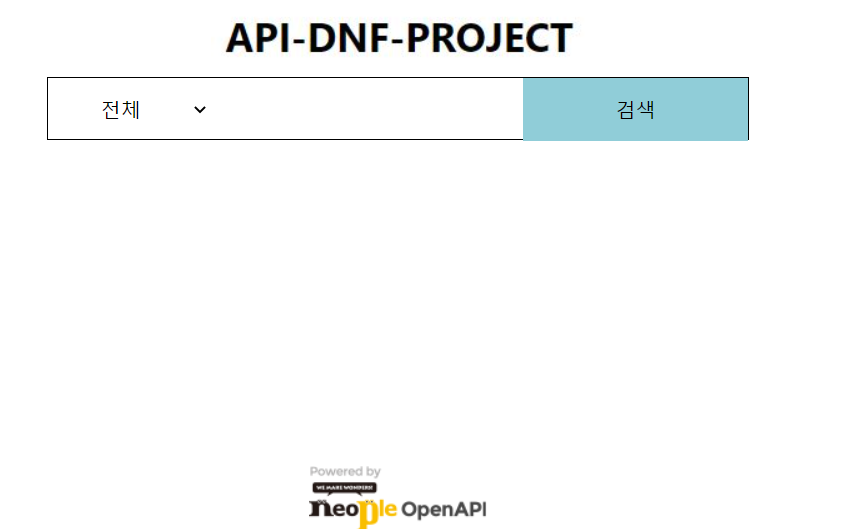
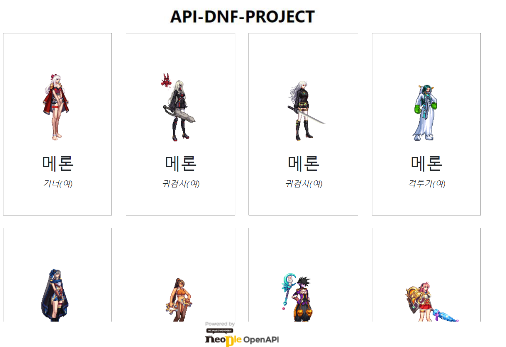
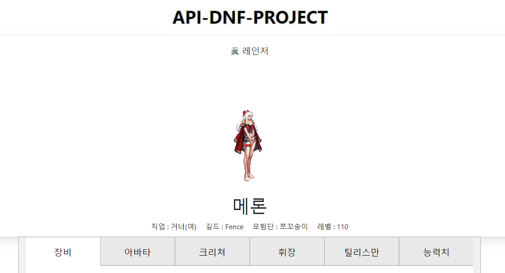
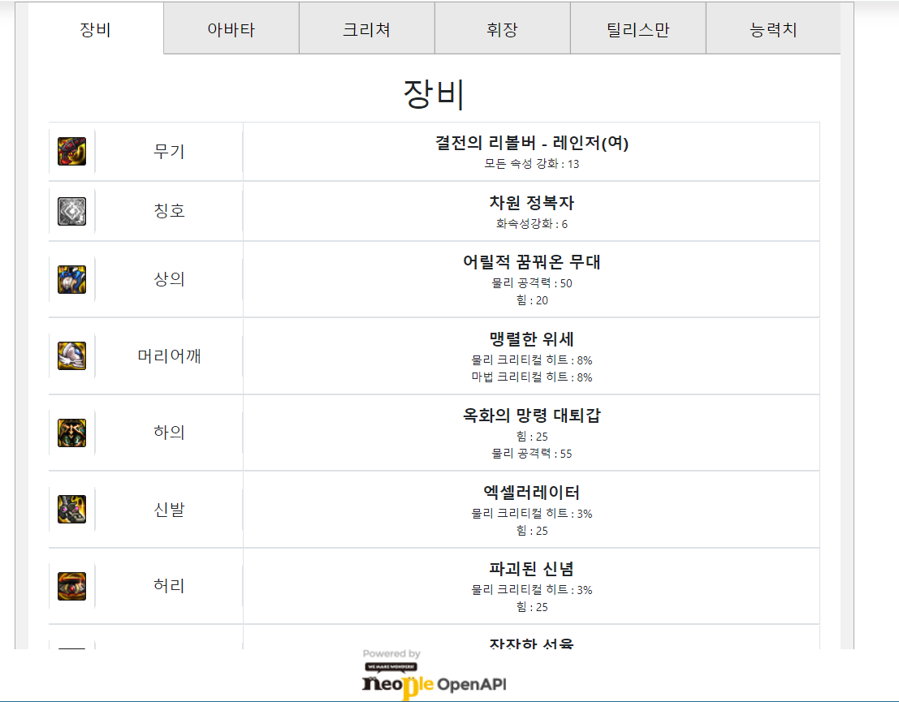
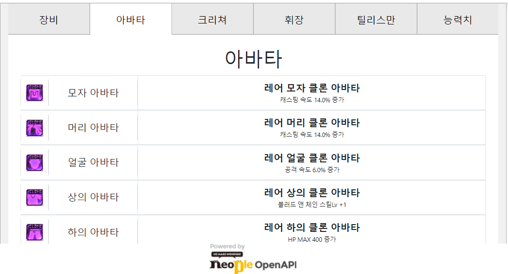
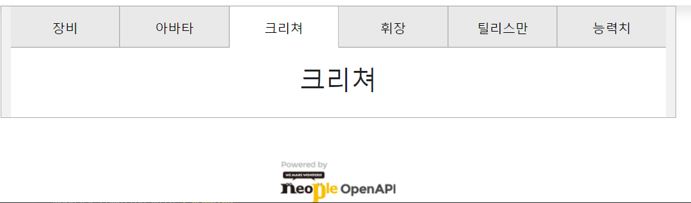
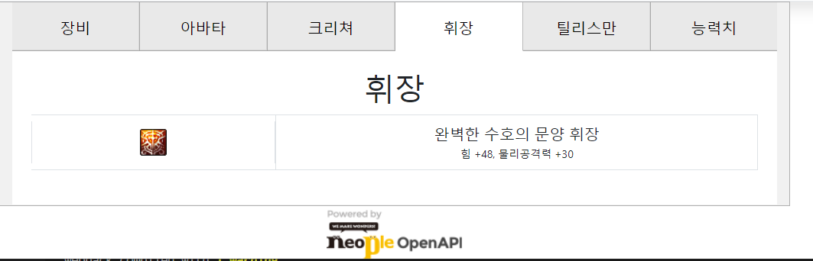
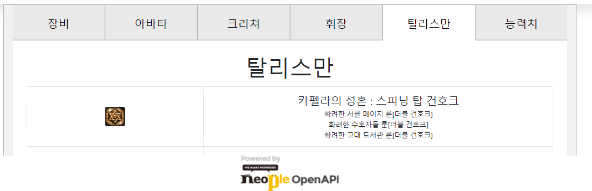
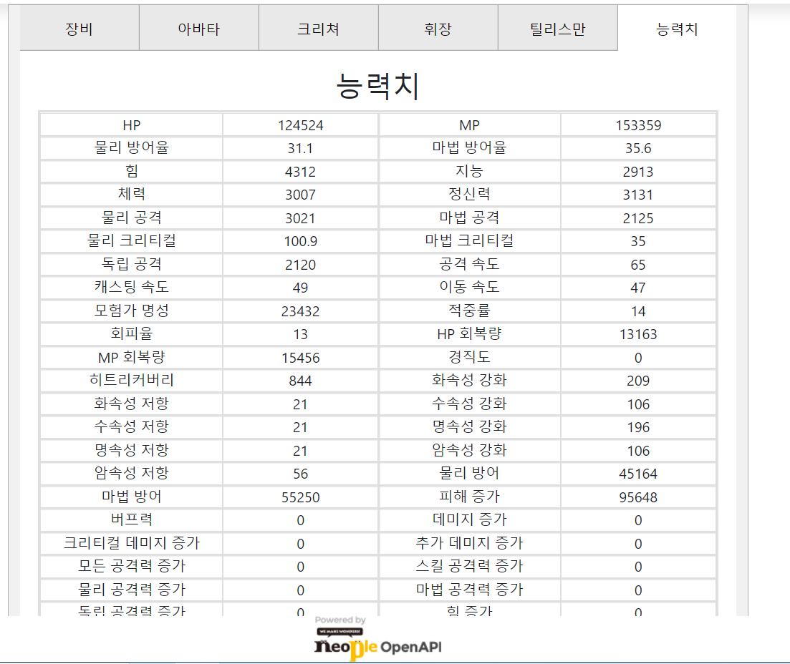

# **던파API사이트**

> 이 프로젝트는 던파API로 홈페이지를 구축 및 API사용법을 익히기 위한 스터디 프로젝트입니다.

제작기간 : 2022-07-16 - 2022-07-24 
 
제작자 : 이승제
 

 [던파API Github](https://github.com/merororo2/DNF) 

---
## 사용기술
- **React**
- **던파API**
 

---
## **✨** **FrontEnd** 

 
✨ **기능** : 검색하고 싶은 캐릭터와 서버를 입력받기 위한 폼을 만들었습니다. 

 
✨**기능** : 서버와 캐릭터 이름을 치고 검색을 클릭하면 검색한 이름이 들어간 캐릭터를 4개씩 보여주게 만들었습니다. 
 
✨**기능** : 캐릭터의 이미지를 클릭하면 캐릭터의 각성명, 캐릭터명, 직업, 길드, 모험단, 레벨을 보여줍니다. 캐릭터의 장비, 아바타, 크리쳐, 휘장, 탈리스만, 능력치를 탭으로 구현하였습니다. 
 
 
 
 
 
 
✨**기능** : 각 탭을 클릭하면 탭에 맞는 이미지, 슬롯명, 장비명, 인챈트목록, 능력치를 보여줍니다. 아이템이 존재하지않는다면 아무것도 나타내지 않습니다.
 

# **후기**

## **FrontEnd**
- 클라이언트에서 던파API를 호출하는데 Cors문제가 생겨 어려움이 있었습니다.
- Axios 사용해본 경험이 있어 큰 어려움 없이 수월하게 사용이 가능해 졌습니다.
- 유튜브에 올라와있는 영상을 참조해 간단한 탭메뉴를 어려움없이 구현하게 되었습니다.
- 프로젝트 진행도중 잦은 실수나 오타로 인해 시간을 소비하여 아쉬움이 매우 컸습니다. 